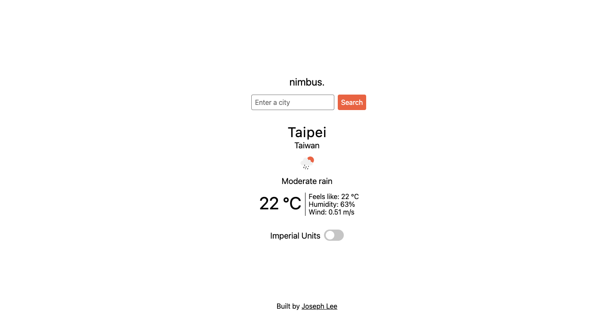

# nimbus.

My implementation of the [weather app project](https://www.theodinproject.com/lessons/node-path-javascript-weather-app) for [The Odin Project](https://www.theodinproject.com/). Try it [here](https://jooo-lee.github.io/nimbus/)!

## Description:

A minimalist weather application that allows users to check the current weather of a city.

## Features:

-   Integration with One Call API 3.0 and Geocoding API to fetch and display data for a specific city
-   Switch to toggle displaying data in metric or imperial units
-   'Loading' component that displays while data is being fetched

## I learned how to:

-   Write asynchronous code using the `async` and `await` keywords
-   Fetch, process and display data from an API
-   Handle errors using try/catch blocks

## Acknowledgements:

[One Call API 3.0](https://openweathermap.org/api/one-call-3), [Geocoding API](https://openweathermap.org/api/geocoding-api) and [icons](https://openweathermap.org/weather-conditions) from [OpenWeather](https://openweathermap.org/).
